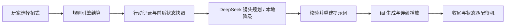

# 口袋对战实验室 · Pocket Battle Lab

一个探索「AI 实时生成游戏演出」的宝可梦单打回合制实验：玩家选择招式，规则引擎结算战斗，AI 把结果演成连续的二维动画。网页采用复古像素 UI，生成视频采用手绘赛璐璐动画风格；视频直接在原战场内播放，不弹出独立播放器。

> 非官方、本地非商业学习原型，未取得宝可梦角色授权。视频生成、云端提帧和语音合成可能产生费用；打开页面也可能触发素材预热，请先阅读配置与使用边界。

## 项目背景

当一段短视频的生成时间接近、甚至短于它的播放时间，游戏能否不再只播放预制动画，而是根据玩家刚刚做出的选择，动态生成下一段演出？

这个项目用大家熟悉的宝可梦对战验证这一想法：玩家发出指令，训练家喊招，宝可梦应答、出招、受击，最后回到对峙状态。重点是让生成发生在上一段播放期间，并让角色身份、招式效果和异常状态跨镜头延续。

这是一条可运行的实验链路，不是「固定几秒生成」或「永不等待」的承诺。排队、生成、传输和解码都会影响真实体验。

## 项目截图

当前桌面页面实拍，使用项目已有的本地待机视频；截图过程禁用了生成接口，没有新增付费素材。

**对战主界面：动画待机画面与像素状态面板叠加。**


<details>
<summary>展开查看招式选择界面</summary>

招式面板展示属性、威力、PP 以及适用的属性克制提示。


</details>

## 实现方式

技术栈：原生 HTML / CSS / JavaScript、Node.js HTTP 服务、HTMLVideoElement 多播放器，以及本地 FFmpeg。没有前端框架或 Three.js 运行依赖。



### 状态 → 分镜 → 画面

1. **状态层**：纯 JavaScript 规则引擎先结算行动顺序、命中、伤害、属性倍率、异常状态和昏厥，输出事件与前后状态快照。AI 不决定谁命中、扣多少血或谁获胜。
2. **分镜层**：DeepSeek 只返回紧凑的镜头字段——结算时刻、切点、景别、运镜；程序校验后，把真实招式与结果重建为完整提示词。前端规划预算为 3 秒，超时或输出无效时采用本地确定性分镜。
3. **画面层**：通常每次实际行动对应一个 5 秒片段，片内组织特写、双方行动镜头与结果反应，不固定生成六段。麻痹、睡眠、冰冻导致的无法行动，以及混乱自伤，按真实记录独立编排。
4. **状态继承**：提示词携带双方已有／新增状态。睡眠不能自行清醒、冰冻不能凭切镜解除；只有真实昏厥才要求倒地与螺旋眼。缓存按阵容、异常状态、语言和素材版本区分，普通 HP 变化不重做待机。

### 连续播放与提前准备

- **选招**：本地训练家剪影配合 MiniMax 喊招，再接状态匹配的听令特写；同时并行规划与生成首段。听令未及时就绪时走现有兜底，不无限等待。
- **身份与首帧**：有匹配的听令、场景或上一回合尾帧时用 Turbo 接续；没有合适锚点时，用 Reference 模型同时传入双方动画风格参考图。参考图锁定身份，不要求输出像素画。
- **尾帧衔接**：攻击片完成后调用云端提帧，直接把 HTTPS 图片 URL 作为下一片首帧，不等本地完整下载、抽帧和上传。依赖上一片尾帧的片段仍顺序生成，不能无条件全部并发。
- **播放与下载**：首段缓冲并解码就绪后立即播放，不等第二段。三个视频槽负责当前播放、预载和保帧；下一片未好时保持当前尾帧，等真实首帧出现后切换。播放与归档共享一次上游 GET，本地 Range 播放请求不再触发上游 Range 下载。
- **换人**：我方训练家举球 → 收回 → 放出 → 待机；提前缓存收回，在过渡期间准备放出，放出素材可用后预热新阵容的待机、听令和收回。
- **状态与收尾**：战斗播放期间预热最终状态素材；行动结束后，以最后攻击尾帧生成收尾片，接回同框对峙，再由匹配的待机接管。低血量与异常状态影响表演，不改变规则结果。

新战斗／场景片固定 `seed = 42`，但固定 seed 不保证不同提示词和输入图的输出一致。本地 FFmpeg 仍用于待机闭环、听令响度处理、场景真实尾帧和历史归档恢复，不再承担新攻击片的实时尾帧链路。

## 使用到的 API

以下是当前代码接入的服务；模型可用性、权限和价格以供应商为准。

| 服务 | 接口 / 模型 | 项目用途 |
| --- | --- | --- |
| [DeepSeek Chat Completions](https://api-docs.deepseek.com/api/create-chat-completion/) | `POST https://api.deepseek.com/chat/completions`；默认 `deepseek-v4-flash` | 紧凑镜头规划，可用 `DEEPSEEK_MODEL` 覆盖 |
| [fal H3 Max Turbo](https://fal.ai/models/minimax/h3-max-turbo/image-to-video/api) | `minimax/h3-max-turbo/image-to-video` | 带首帧的攻击、续段、收回、听令与收尾等片段 |
| [fal H3 Max Reference](https://fal.ai/models/minimax/h3-max/reference-to-video/api) | `minimax/h3-max/reference-to-video` | 无可用首帧时开场、放出新角色、携带双方参考图的状态场景 |
| [fal FFmpeg Extract Frame](https://fal.ai/models/fal-ai/ffmpeg-api/extract-frame/api) | `fal-ai/ffmpeg-api/extract-frame`，`frame_type: last` | 返回攻击片尾帧 URL，续段、状态预热与归档共享请求 |
| [MiniMax 语音 WebSocket](https://platform.minimaxi.com/docs/api-reference/speech-t2a-websocket) | `wss://api.minimax.cn/ws/v1/t2a_v2`；`speech-2.8-turbo` | 我方喊招与换人播报，按语言和台词缓存 |
| [fal H3 Max Turbo 文生视频](https://fal.ai/models/minimax/h3-max-turbo/text-to-video/api) | `minimax/h3-max-turbo/text-to-video` | 素材脚本预生成训练家剪影，游戏中复用本地文件 |

视频经 fal 调用，**不是 MiniMax 视频直连接口**；语音才直接连接 MiniMax。中文音色为 `Chinese (Mandarin)_Straightforward_Boy`，英文、日文使用对应语言音色。喊招语音与视频分开播放，没有烘焙进视频。

密钥只由 Node.js 服务端读取。角色图片来自本地保存的 PokéAPI 素材，游玩时不需要在线查询 PokéAPI；来源见 [第三方声明](THIRD_PARTY_NOTICES.md) 和 [角色参考图记录](assets/video-references/artwork/PROVENANCE.md)。

## 本地运行

依赖：Node.js、npm、FFmpeg。本项目本地验证环境为 Node.js 24 与 FFmpeg 8.1；`ffmpeg` 需在 PATH 中，或通过 `FFMPEG_PATH` 指定。

```bash
npm ci
# 首次配置；已有 .env.local 时不要覆盖
cp -n .env.example .env.local
```

编辑 `.env.local`，填入自己的密钥：

```dotenv
DEEPSEEK_API_KEY=你的_DeepSeek_Key
FAL_KEY=你的_fal_Key
FAL_VIDEO_RESOLUTION=480P
MINIMAX_API_KEY=你的_MiniMax_Key
```

显式加载环境文件后启动：

```bash
node --env-file=.env.local server.mjs
```

访问 [http://localhost:4173/](http://localhost:4173/)。若已在进程环境中配置好变量，也可使用 `npm start`。`--env-file` 确保 DeepSeek 密钥及分辨率等变量一起加载，不要假设服务会自动读取所有 `.env.local` 配置。

可选：`PORT` 修改端口；`DEEPSEEK_MODEL` 覆盖规划模型；`FAL_VIDEO_RESOLUTION` 支持 `480P` / `768P`，用于攻击跑道。缺少规划密钥时使用本地分镜；缺少视频或语音密钥时相关生成不可用，规则与本地展示仍可运行。

### 费用与缓存

- 页面初始化、换人和异常状态变化可能预热多个视频，不是只有点击攻击才会产生费用。视频、云端提帧、DeepSeek 规划与未缓存语音分别计费，本文不提供固定每场价格。
- 已生成媒体与提交记录保存在 `.local/`。删除缓存可能导致再次生成和计费；切换语言也可能需要新素材。
- 明确且可重试的视频生成失败最多自动重生成一次；未知提交结果不盲目重买。下载或加工失败优先恢复原任务。跳过不保证供应商已受理的任务免于计费。
- `.env*`（示例除外）、`.local/`、`outputs/` 已被 Git 忽略；不要提交真实密钥或包含私密信息的运行产物。

## 当前功能与边界

- 默认我方：皮卡丘、杰尼龟、妙蛙种子；对方：小火龙、喷火龙、耿鬼。
- 支持物理／特殊伤害、STAB、18 属性相克、要害、能力阶级、速度／优先度、命中与 PP、异常状态、换人、道具和胜负判断。
- 支持中文、英文、日文 UI；生成提示词与语音随语言切换，旧视频不会被重新配音。
- 仅实现核心单打规则，不覆盖完整招式库、特性、持有物、天气、场地、双打或太晶化；重点验收桌面体验。
- AI 可能出现身份漂移、动作不准确或状态表现偏差；提示词不是逐帧保证。生成较慢时仍可能停留在尾帧，动画失败不会抹掉已结算的战斗结果。

## 代码与验证

| 位置 | 职责 |
| --- | --- |
| `src/battle-engine.js`、`src/data.js` | 战斗规则与数据 |
| `src/attack-storyboard.js`、`src/compact-storyboard.js` | 行动记录、镜头校验、提示词重建 |
| `src/fal-video-runway.js`、`src/cloud-tail-frame.js` | 视频生成跑道与云端尾帧 |
| `src/scene-video-service.js`、`src/scene-video-client.js` | 状态素材生成、预热、缓存与恢复 |
| `src/attack-video-player.js`、`src/app.js` | 多槽播放、UI 与演出编排 |
| `server.mjs` | 同源媒体服务与外部 API 代理 |
| `assets/`、`tests/` | 本地素材与自动回归测试 |

```bash
npm test
```

自动测试覆盖规则、状态继承、生成参数、共享下载、取消和失败恢复，供应商调用使用模拟接口。通过测试不等于成片质量或真实延迟通过验收。历次实测与限制见 [历史验收档案](docs/archive/)；其中旧脚本与历史命令不作为当前运行指南。

## 素材与权利说明

这是非官方、本地非商业学习原型，不代表获得 Pokémon 知识产权许可。角色、名称及图像归 The Pokémon Company、Nintendo、Creatures、GAME FREAK 及相应权利人所有。非商业用途不等于自动获得授权，请勿将本原型公开部署或收费发行。

字体、图片来源与许可记录见 [THIRD_PARTY_NOTICES.md](THIRD_PARTY_NOTICES.md)。截图展示项目实际页面，不是官方宣传图。
