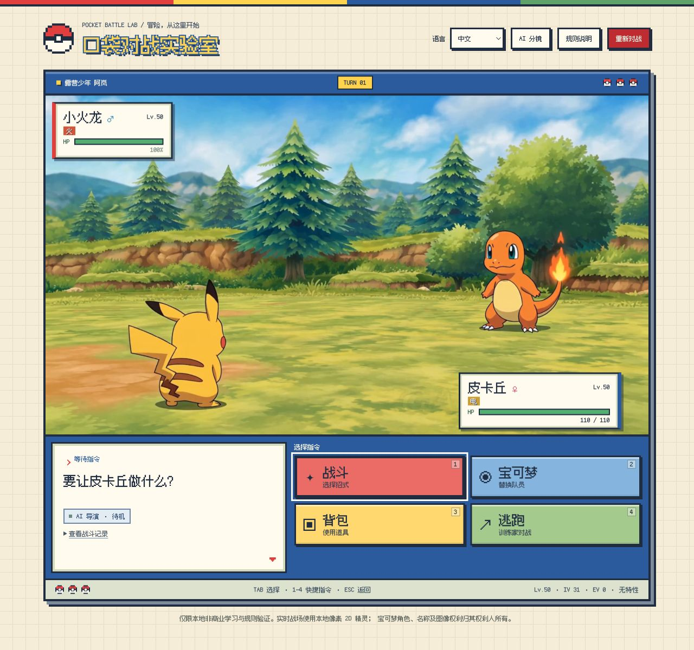
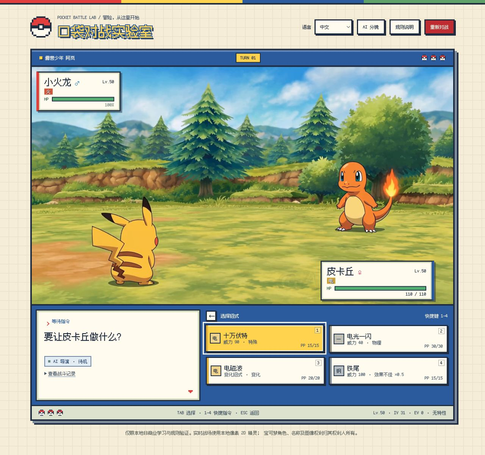
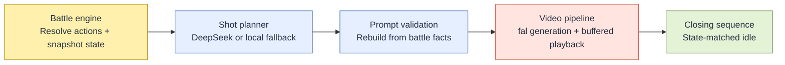

<div align="center">

<h1>Pocket Battle Lab</h1>

<p><strong>Choose a move. Watch the battle come to life.</strong></p>

<p>Rule-driven Pokémon battles, brought to life with AI-generated 2D animation.</p>

<p>
  <code>Turn-based singles</code> ·
  <code>Pixel UI + anime video</code> ·
  <code>Chinese / English / Japanese</code>
</p>

<p>
  <a href="#preview">Preview</a> ·
  <a href="#quickstart">Quickstart</a> ·
  <a href="#architecture">Architecture</a> ·
  <a href="#api-integrations">APIs</a> ·
  <a href="#development">Development</a>
</p>

</div>

> [!NOTE]
> Unofficial, local, non-commercial learning prototype. Read the setup instructions and limitations before running.

## Preview

<p align="center">
  
  <br>
  <sub>Actual desktop gameplay · Chinese UI · Existing local idle video</sub>
</p>

Players choose moves, the rules engine resolves the battle, and AI turns the results into a continuous animated sequence. Videos play **inside the battlefield**, without a separate player modal.

| Rules first | Anime presentation | Continuous playback |
| :--- | :--- | :--- |
| Code resolves hits, damage, and status. | Hand-drawn, cel-shaded video over a retro pixel UI. | Prewarm upcoming assets; hold the last frame if the next clip is late. |

<details>
<summary><strong>More screenshots — move selection</strong></summary>

The move panel displays type, power, PP, and relevant type-effectiveness hints.



</details>

<sub>Generation endpoints were disabled during screenshot capture. No additional paid assets were generated.</sub>

## The Experiment

When generating a short video takes about as long as—or less time than—playing it, could a game generate its next cinematic from the player's latest choice instead of relying entirely on prerecorded animations?

This project explores that idea through familiar Pokémon battles: the player gives an order, the trainer calls out a move, the Pokémon responds, attacks, takes a hit, and returns to a standoff. The goal is to generate the next segment while the previous one plays, preserving character identity, move effects, and status conditions across shots.

> [!NOTE]
> This is a working experimental pipeline, not a promise of fixed generation times or zero waiting. Queueing, generation, transfer, and decoding all affect the experience.

## Quickstart

Requirements: Node.js, npm, and FFmpeg. The locally verified environment uses Node.js 24 and FFmpeg 8.1. Make `ffmpeg` available on PATH or set `FFMPEG_PATH`.

### 1. Install and configure

```bash
npm ci
# First-time setup only; do not overwrite an existing .env.local
cp -n .env.example .env.local
```

Edit `.env.local` with your own keys:

```dotenv
DEEPSEEK_API_KEY=replace_with_your_deepseek_key
FAL_KEY=replace_with_your_fal_key
FAL_VIDEO_RESOLUTION=480P
MINIMAX_API_KEY=replace_with_your_minimax_key
```

### 2. Start the server

Load the environment file explicitly:

```bash
node --env-file=.env.local server.mjs
```

Open [http://localhost:4173/](http://localhost:4173/). If the variables are already set in the process environment, you can also use `npm start`. The `--env-file` option ensures that the DeepSeek key, resolution, and other variables are loaded together; do not assume the service automatically reads every setting from `.env.local`.

### 3. Optional settings

`PORT` changes the port; `DEEPSEEK_MODEL` overrides the planner model; `FAL_VIDEO_RESOLUTION` accepts `480P` or `768P` for attack generation. Without a planner key, local storyboards are used. Without video or speech keys, the corresponding generation features are unavailable, but the rules engine and local presentation can still run.

### Billing and Caching

- Page initialization, switching Pokémon, and status changes may prewarm multiple videos. Attacking is not the only action that can incur charges. Video, cloud frame extraction, DeepSeek planning, and uncached speech are billed separately; this README does not quote a fixed per-battle cost.
- Generated media and submission records are stored in `.local/`. Deleting caches may trigger regeneration and additional charges; changing language may also require new assets.
- Confirmed, retryable video-generation failures allow at most one automatic regeneration. An unknown submission outcome does not trigger a blind resubmission. Download or processing failures first attempt to recover the original task. Skipping playback does not guarantee that an already accepted provider task is free.
- `.env*` files (except the example), `.local/`, and `outputs/` are Git-ignored. Never commit real keys or runtime artifacts containing private information.

## Architecture

**The rules engine owns the outcome. AI owns the presentation.**

The stack is vanilla HTML / CSS / JavaScript, a Node.js HTTP server, multiple HTMLVideoElement players, and local FFmpeg. There is no frontend framework or Three.js runtime dependency.



<details>
<summary><strong>Battle state, storyboards, and status continuity</strong></summary>

1. **Battle state:** A pure JavaScript rules engine resolves action order, hits, damage, type multipliers, status conditions, and fainting, then emits events and before/after snapshots. AI does not decide who hits, how much HP is lost, or who wins.
2. **Storyboard:** DeepSeek returns only compact shot fields: outcome timing, cut points, shot sizes, and camera movement. The application validates these fields and rebuilds full prompts from the actual moves and results. The frontend allows 3 seconds for planning; a timeout or invalid output selects a deterministic local storyboard.
3. **Video:** Each recorded action normally gets one 5-second clip, combining close-ups, action shots, and reactions. The sequence is not fixed at six clips. Inability to act due to paralysis, sleep, or freezing, as well as confusion self-damage, receives its own treatment based on the battle record.
4. **State continuity:** Prompts carry both existing and newly applied conditions. A sleeping Pokémon must not wake without a corresponding game event, and a camera cut must not remove freezing. Collapse and spiral eyes are requested only for an actual faint. Caches distinguish the active pair, status conditions, language, and asset version; ordinary HP changes do not regenerate idle clips.

</details>

<details>
<summary><strong>Playback, prewarming, switching, and closing sequences</strong></summary>

- **Move selection:** A local trainer-silhouette clip plays alongside the MiniMax move callout, followed by a state-matched Pokémon response close-up. Planning and first-clip generation proceed in the background. If the response clip is not ready in time, the existing fallback is used rather than waiting indefinitely.
- **Identity and opening frame:** A matching response clip, scene frame, or previous turn's tail frame lets Turbo continue the scene. Without a suitable anchor, the Reference model receives anime-style images of both Pokémon. These references preserve identity; they do not require pixel-art output.
- **Frame continuity:** Once an attack clip is generated, cloud extraction returns its final frame as an HTTPS image URL for the next clip. This avoids waiting for a full local download, extraction, and upload. Clips that depend on the previous tail frame still generate sequentially; they cannot all run in parallel.
- **Playback and downloads:** The first clip starts as soon as it is buffered and decoded, without waiting for the second. Three video slots handle active playback, preloading, and frame holding. If the next clip is late, the current tail frame remains visible until the next real frame is ready. Playback and archiving share one upstream GET; local Range playback requests no longer trigger upstream Range downloads.
- **Switching Pokémon:** Trainer raises a Poké Ball → recall → send-out → idle. Recall clips are cached in advance; the transition provides time to prepare the send-out. Once the send-out asset is available, the new pair's idle, response, and recall clips are prewarmed.
- **Status changes and closing sequence:** Assets matching the final battle state are prewarmed during combat playback. After the actions finish, the last attack's tail frame starts a closing clip that returns to a shared standoff before the matching idle takes over. Low HP and status conditions affect the performance, not the rules outcome.

New battle and scene clips use `seed = 42`, but a fixed seed does not guarantee identical results across different prompts or input images. Local FFmpeg still handles idle looping, response-clip loudness processing, scene tail frames, and recovery from archived media; it no longer handles the real-time tail-frame path for new attack clips.

</details>

## API Integrations

Video goes through **fal**, shot planning through **DeepSeek**, and callout speech directly through **MiniMax**. Model availability, access permissions, and pricing are determined by the providers.

| Service | Endpoint / Model | Purpose |
| --- | --- | --- |
| [DeepSeek Chat Completions](https://api-docs.deepseek.com/api/create-chat-completion/) | `POST https://api.deepseek.com/chat/completions`; default: `deepseek-v4-flash` | Compact shot planning; overridable with `DEEPSEEK_MODEL` |
| [fal H3 Max Turbo](https://fal.ai/models/minimax/h3-max-turbo/image-to-video/api) | `minimax/h3-max-turbo/image-to-video` | Attack, continuation, recall, response, and closing clips with an opening frame |
| [fal H3 Max Reference](https://fal.ai/models/minimax/h3-max/reference-to-video/api) | `minimax/h3-max/reference-to-video` | Opening clips without a usable first frame, send-outs, and state-specific scenes with both character references |
| [fal FFmpeg Extract Frame](https://fal.ai/models/fal-ai/ffmpeg-api/extract-frame/api) | `fal-ai/ffmpeg-api/extract-frame`, `frame_type: last` | Attack tail-frame URLs; one request shared by continuation, state prewarming, and archiving |
| [MiniMax Speech WebSocket](https://platform.minimaxi.com/docs/api-reference/speech-t2a-websocket) | `wss://api.minimax.cn/ws/v1/t2a_v2`; `speech-2.8-turbo` | Player move callouts and switch announcements, cached by language and dialogue |
| [fal H3 Max Turbo Text to Video](https://fal.ai/models/minimax/h3-max-turbo/text-to-video/api) | `minimax/h3-max-turbo/text-to-video` | Asset scripts pre-generate trainer silhouettes for reuse as local files |

Video is generated through fal, **not through MiniMax's direct video API**. Only speech connects directly to MiniMax. The Chinese voice is `Chinese (Mandarin)_Straightforward_Boy`; English and Japanese use their respective language voices. Callout speech plays separately and is not baked into the video.

Only the Node.js server reads API keys. Character images are locally stored PokéAPI assets, so gameplay does not require live PokéAPI lookups. See the [third-party notices](THIRD_PARTY_NOTICES.md) and [character reference provenance](assets/video-references/artwork/PROVENANCE.md).

## Scope and Limitations

- Default player team: Pikachu, Squirtle, and Bulbasaur. Opposing team: Charmander, Charizard, and Gengar.
- Supports physical and special damage, STAB, the 18-type effectiveness chart, critical hits, stat stages, speed and move priority, accuracy and PP, status conditions, switching, items, and win/loss resolution.
- Chinese, English, and Japanese UI are supported. Generation prompts and speech follow the selected language; existing videos are not re-dubbed.
- Implements core singles rules only, not the full move catalog, abilities, held items, weather, terrain, doubles, or Terastallization. Validation focuses on the desktop experience.
- AI output may drift in identity, action accuracy, or status portrayal. Prompts are not frame-by-frame guarantees. Slow generation can still leave the display holding a tail frame, and an animation failure does not erase resolved battle results.

## Development

| Location | Responsibility |
| --- | --- |
| `src/battle-engine.js`, `src/data.js` | Battle rules and data |
| `src/attack-storyboard.js`, `src/compact-storyboard.js` | Action records, shot validation, and prompt reconstruction |
| `src/fal-video-runway.js`, `src/cloud-tail-frame.js` | Video generation pipeline and cloud tail-frame extraction |
| `src/scene-video-service.js`, `src/scene-video-client.js` | State-specific asset generation, prewarming, caching, and recovery |
| `src/attack-video-player.js`, `src/app.js` | Multi-slot playback, UI, and cinematic sequencing |
| `server.mjs` | Same-origin media serving and external API proxying |
| `assets/`, `tests/` | Local assets and automated regression tests |

```bash
npm test
```

Automated tests cover rules, state continuity, generation parameters, shared downloads, cancellation, and failure recovery. Provider calls are mocked. Passing tests does not validate finished-video quality or real generation latency.

## License

The original source code and original textual documentation in this repository are licensed under the [MIT License](LICENSE), copyright (c) 2026 xflare-bot. This covers the project's own code in `src/`, `scripts/`, and `tests/`, its HTML, CSS, server and configuration files, and its original documentation, only to the extent that the contributors have the rights to license them.

**The MIT grant does not cover media assets or third-party material.** Files in `assets/` and `docs/images/`, including sprites, reference artwork, fonts, audio, generated videos, and screenshots, are excluded from the project's MIT grant. Third-party code and other third-party material retain their respective licenses and rights; see [THIRD_PARTY_NOTICES.md](THIRD_PARTY_NOTICES.md). No Pokémon character, artwork, name, design, or trademark rights are granted by this project's code license.

“Local, non-commercial learning prototype” describes this demo's purpose, not an additional restriction on MIT-licensed code. Commercial use, modification, and closed-source reuse of the covered code are permitted under MIT's terms; rights to excluded assets must be addressed separately.

## Assets and Rights

This is an unofficial learning prototype, not a license to use Pokémon intellectual property. Characters, names, and imagery belong to The Pokémon Company, Nintendo, Creatures, GAME FREAK, and their respective rights holders. Non-commercial use does not automatically grant permission. Obtain the necessary permissions or replace restricted assets before distributing or deploying a version that includes them; adding a code license does not resolve those asset rights.

Font and image sources and license records are documented in [THIRD_PARTY_NOTICES.md](THIRD_PARTY_NOTICES.md). Screenshots show the actual project interface, not official promotional material.
